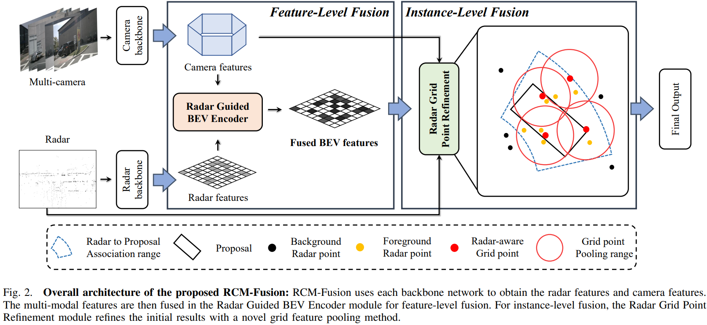

<div align="center">   
# RCM-Fusion: Radar-Camera Multi-Level Fusion for 3D Object Detection
</div>


> **RCM-Fusion: Radar-Camera Multi-Level Fusion for 3D Object Detection**, ICRA 2024
> - [Paper in arXiv](https://arxiv.org/abs/2307.10249)
> Jisong Kim*, Minjae Seong*, Geonho Bang, Dongsuk Kum, Jun Won Choi**


# Abstract
While LiDAR sensors have been successfully applied to 3D object detection, the affordability of radar and camera sensors has led to a growing interest in fusing radars and cameras for 3D object detection. However, previous radar-camera fusion models could not fully utilize the potential of radar information. In this paper, we propose {\it Radar-Camera Multi-level fusion} (RCM-Fusion), which attempts to fuse both modalities at feature and instance levels. For feature-level fusion, we propose a {\it Radar Guided BEV Encoder} which transforms camera features into precise BEV representations using the guidance of radar Bird’s-Eye-View (BEV) features and combines the radar and camera BEV features. For instance-level fusion, we propose a {\it Radar Grid Point Refinement} module that reduces localization error by accounting for the characteristics of the radar point clouds. The experiments on the public nuScenes dataset demonstrate that our proposed RCM-Fusion achieves state-of-the-art performances among single frame-based radar-camera fusion methods in the nuScenes 3D object detection benchmark.


# Methods



# Getting Started
- [Installation](docs/install.md) 
- [Prepare Dataset](docs/prepare_dataset.md)
- [Run and Eval](docs/getting_started.md)

# Model Zoo

| Backbone | Method | Lr Schd | NDS| mAP| Config | Download |
| :---: | :---: | :---: | :---: | :---:| :---: | :---: |
| R50 | RCM-Fusion-R50 | 24ep | 53.5|45.2 |[config](projects/configs/rcmfusion_icra/rcm-fusion_r50.py) |[model](ckpts/rcm-fusion-r50-icra-final.pth)|
| R101 | RCM-Fusion-R101 | 24ep | 58.7|50.6 |[config](projects/configs/rcmfusion_icra/rcm-fusion_r101.py) |[model](ckpts/rcm-fusion-r101-icra-final.pth)|


# Bibtex
If this work is helpful for your research, please consider citing the following BibTeX entry.

```
@article{icra2024RCMFusion,
  title={Rcm-fusion: Radar-camera multi-level fusion for 3d object detection},
  author={Kim, Jisong and Seong, Minjae and Bang, Geonho and Kum, Dongsuk and Choi, Jun Won}
  journal={arXiv preprint arXiv:2307.10249},
  year={2024}
}
```

# Acknowledgement

Many thanks to these excellent open source projects:
- [BEVFormer](https://github.com/fundamentalvision/BEVFormer) 
- [mmdet3d](https://github.com/open-mmlab/mmdetection3d)
- [detr3d](https://github.com/WangYueFt/detr3d)
